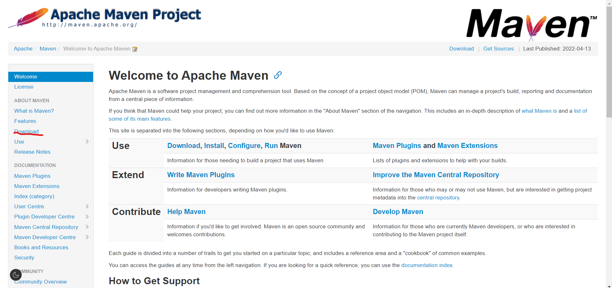
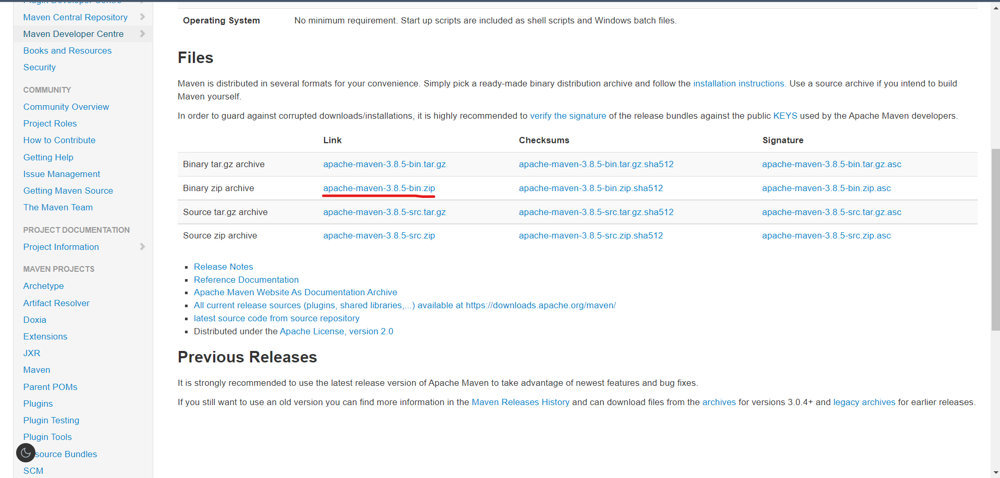
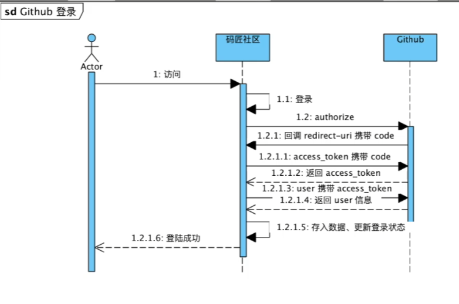
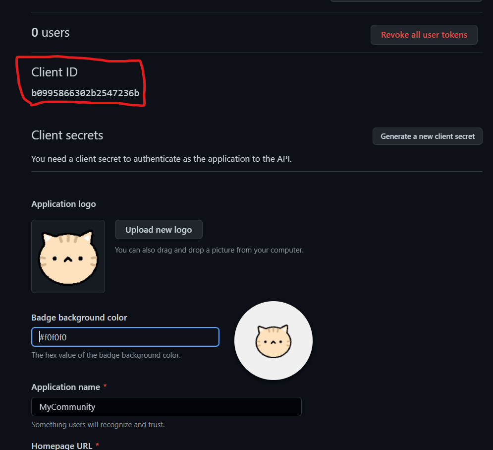
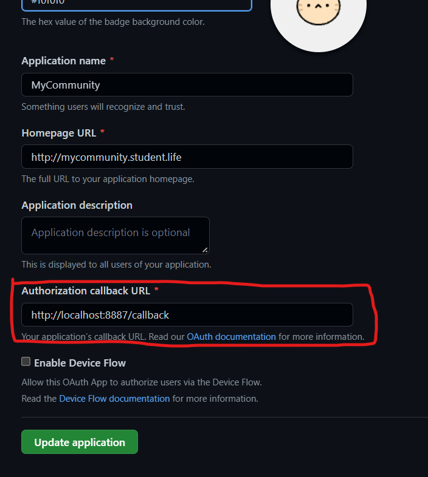

# 论坛系统项目学习架构日志

---

## 主要内容

### Day 01——2022.4.14

#### 1.Maven安装与配置

* [Maven – Welcome to Apache Maven](https://maven.apache.org/index.html "官网下载链接")————Maven官网下载



* 配置Maven的setings.xml文件
  * 解压maven的压缩文件后进入conf文件夹打开setings.xml文件进行配置。
  * 配置maven本地仓库

    * 在任意位置创建一个maven本地仓库文件夹（repository）

      ```xml
      <localRepository>D:\app\IDEA\Environment\maven\apache-maven-3.6.3\maven-repo</localRepository>

      ```

      将此处setings.xml的 `<localRepository></localRepository>内改成仓库文件夹的地址`
  * 配置阿里云maven镜像

    * 为了让下载速度更快在 `<mirrors></mirrors>之间添加下列代码`

    ```xml
        <mirror>
          <id>alimaven</id>
          <name>aliyun maven</name>
          <url>http://maven.aliyun.com/nexus/content/repositories/central/</url>
          <mirrorOf>central</mirrorOf>
        </mirror>


    ```

    ---
  * 配置maven全局JDK版本

    * 在 `<profile></profile>之间添加JDK版本号的代码`
      ```xml
          <!-- java版本 -->
          <profile>
            <id>jdk-1.8</id>
            <activation>
              <activeByDefault>true</activeByDefault>
              <jdk>1.8</jdk>
            </activation>

            <properties>
              <maven.compiler.source>1.8</maven.compiler.source>
              <maven.compiler.target>1.8</maven.compiler.target>
              <maven.compiler.compilerVersion>1.8</maven.compiler.compilerVersion>
            </properties>
          </profile>

      ```

### Day 02——2022.4.15

#### 1.Spring Boot项目创建与文件内容

* 1.创建Spring Boot项目

直接在IDEA中创建Spring项目，并等待项目依赖安装完成

* pom.xml（Project Object Model）

Maven中的文件用于更快更便捷的管理各种文件，配置spring的项目包

* .gitignore

用于配置不需要放在GitHub托管的文件

* Application.java

可以直接运行Spring项目

#### 2.Spring Boot项目的运行

* spring.io/guides

Spring 官方指示文档，可以直接在这个网站找到组件如何构建

* 使用 Serving Web Content with Spring MVC组件
  * 导入依赖包
    ```xml
            <dependency>
                <groupId>org.springframework.boot</groupId>
                <artifactId>spring-boot-starter-thymeleaf</artifactId>
            </dependency>
    ```
* 略
  详情去[Getting Started | Serving Web Content with Spring MVC](https://spring.io/guides/gs/serving-web-content/) 官网组件使用教程

#### 3.访问页面

进入	[Getting Started: Serving Web Content](http://localhost:8080/hello?name=ZFiend)(localhost:8080/hello?name=ZFiend) 页面访问新创建的页面。

其中hello为HTML文件名，name=后面的为任何单词。

#### 4.更改端口号

通过 application.properties 文件来修改一些项目设置，可以直接在其中修改端口号，端口号改为8887

```properties
server.port=8887
```

### Day 03——2022.4.16

#### 1.IDEA上提交代码到GitHub

详情见[五、在IDEA中使用GIt版本控制并将本地代码上传至Github - 纯新手 - 博客园 (cnblogs.com)](https://www.cnblogs.com/alone-striver/p/7745744.html)

* 安装Git
* 创建GitHub仓库
* 在IDEA中配置Git
* IDEA项目引入VCS
* 本地Repositories上传到GitHub的 Repositories

### Day 04——2022.4.19

#### 1.明确需求

* 标签列表
* 话题列表
* 热门列表
* 导航列表
* 登录
* 搜索

#### 2.初识Bootstrap

[Bootstrap中文网 (bootcss.com)](https://www.bootcss.com/)

将解压后的css、js、fonts三个文件夹复制到resources文件夹中，通过直接复制引用index.html文件来快速创建一个导航栏

#### 3.使用GitHub登录

[应用 - GitHub Docs](https://docs.github.com/cn/developers/apps)

进入github在最下方找到API进入应用找到[构建 OAuth 应用程序](https://docs.github.com/cn/developers/apps/building-oauth-apps)。

### Day 05——2022.4.24

#### 1.GitHub登录流程

[授权 OAuth 应用程序 - GitHub Docs](https://docs.github.com/cn/developers/apps/building-oauth-apps/authorizing-oauth-apps)



#### 2GitHub登录——调用authorize

通过对index.html里登录按钮处连接的设置访问GitHub

先添加地址

```
https://github.com/login/oauth/authorize
```

再根据创建好的 OAuth Apps 的详细信息来完成链接

完成后：

```html
<a href="https://github.com/login/oauth/authorize?client_id=b0995866302b2547236b&redirect_uri=http://localhost:8887/callback&scope=user&state=1">~登录(L_G)
```

tips:地址输入后后续内容通过 ? 来分隔，后续内容通过 & 来区分

#### 3.GitHub登录——获取code


在src/main/java/com/example/community/controller包里新建AuthorizeController.java用来接收redirect_uri从GitHub中携带回来的code

通过加@Controller标签识别Controller的使用

在callback()方法中引入从GitHub中传回的code和state，最后返回到 index.html 页面

```java
package com.example.community.controller;

import org.springframework.stereotype.Controller;
import org.springframework.web.bind.annotation.GetMapping;
import org.springframework.web.bind.annotation.RequestParam;

@Controller
public class AuthorizeController {
    @GetMapping("/callback")
    public String callback(@RequestParam(name = "code") String code,
                           @RequestParam(name = "state") String state) {
        return "index";
    }
}
```

通过使用OKHTTP来进行post

[OkHTTP官网](https://square.github.io/okhttp/)


## 补充内容
